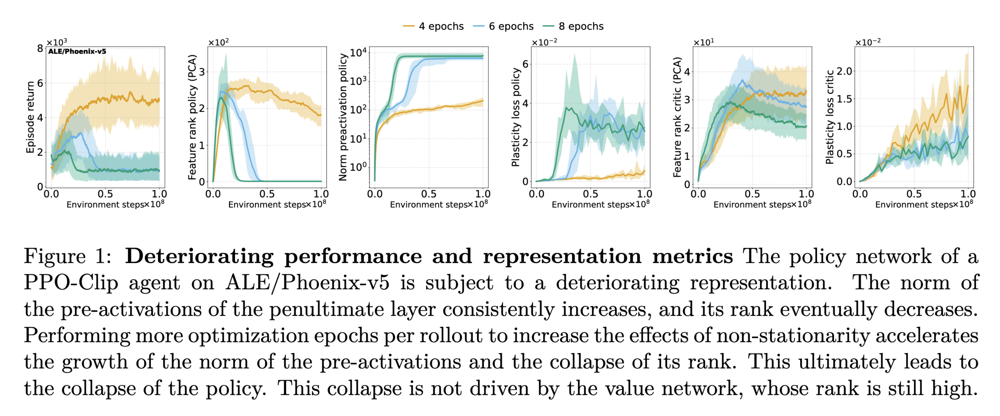
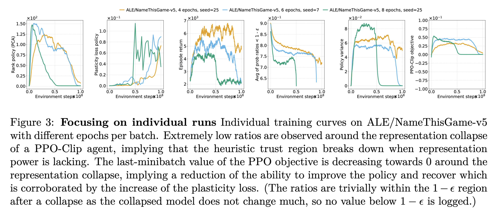
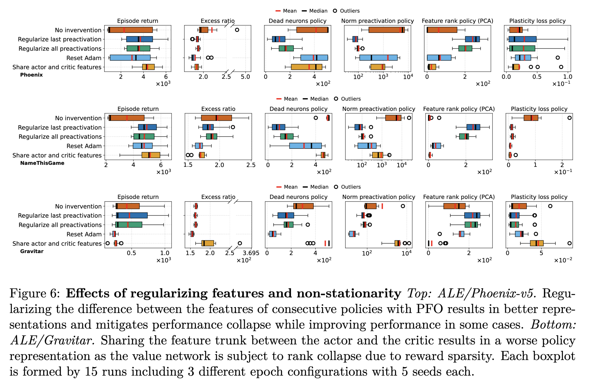
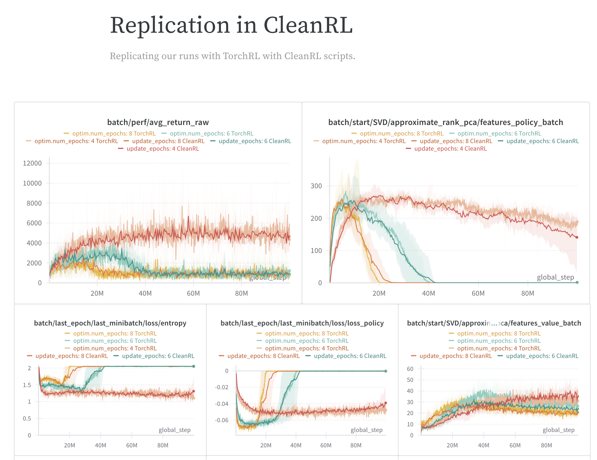

# No Representation, No Trust: Connecting Representation, Collapse, and Trust Issues in PPO

**Skander Moalla (EPFL), Andrea Miele (EPFL), Razvan Pascanu (Google DeepMind), Caglar Gulcehre (EPFL)**

**Paper**: [https://arxiv.org/abs/2405.00662](https://arxiv.org/abs/2405.00662)

## Abstract

Reinforcement learning (RL) is inherently rife with non-stationarity since the states and rewards the agent observes during training depend on its changing policy.
Therefore, networks in deep RL must be capable of adapting to new observations and fitting new targets.
However, previous works have observed that networks in off-policy deep value-based methods exhibit a decrease in representation rank, often correlated with an inability to continue learning or a collapse in performance.
Although this phenomenon has generally been attributed to neural network learning under non-stationarity, it has been overlooked in on-policy policy optimization methods which are often thought capable of training indefinitely.
In this work, we empirically study representation dynamics in Proximal Policy Optimization (PPO) on the Atari and MuJoCo environments, revealing that PPO agents are also affected by feature rank deterioration and loss of plasticity.
We show that this is aggravated with stronger non-stationarity, ultimately driving the actor's performance to collapse, regardless of the performance of the critic.
We draw connections between representation collapse, performance collapse, and trust region issues in PPO, and present Proximal Feature Optimization (PFO), a novel auxiliary loss, that along with other interventions shows that regularizing the representation dynamics improves the performance of PPO agents.





## Getting started

### Code and development environment

We support the following methods and platforms for installing the project dependencies and running the code.

- **Docker/OCI-container for AMD64 machines (+ NVIDIA GPUs)**:
  This option works for machines with AMD64 CPUs and NVIDIA GPUs.
  E.g. Linux machines (EPFL HaaS servers, VMs on cloud providers),
  Windows machines with WSL, and clusters running OCI-compliant containers,
  like the EPFL Run:ai (Kubernetes) clusters.

  Follow the instructions in `installation/docker-amd64-cuda/README.md` to install the environment
  then get back here for the rest of the instructions to run the experiments.

  We ran our experiments on NVIDIA 80GB A100 GPUs and NVIDIA 32GB V100 GPUs.
  The Atari experiments require around 3GB of GPU memory with only the training device set to CUDA
  and around 10GB of GPU memory with all devices set to CUDA.
  The plasticity experiments require 80GB of memory to run on GPU.

- **Conda for osx-arm64**
  This option works for macOS machines with Apple Silicon and can leverage MPS acceleration.

  Follow the instructions in `installation/conda-osx-arm64-mps/README.md` to install the environment
  then get back here for the rest of the instructions to run the experiments.

  We ran some toy experiments with the CarPole environment on an M2 MacBook Air.
  You can run the Atari experiments with MPS acceleration setting `device.training=mps`.


### Logging and tracking experiments

We use [Weights & Biases](https://wandb.ai/site) to log and track our experiments.
If you're logged in, your default entity will be used (a fixed entity is not set in the config),
and you can set another entity with the `WANDB_ENTITY` environment variable.
Otherwise, the runs will be anonymous (you don't need to be logged in).

## Reproduction and experimentation

### Reproducing our results

We provide scripts to fully reproduce our work in the `reproducibility-scripts/` directory.
It has a README at its root describing which scripts reproduce which experiments.
This also includes the plotting notebook.

Raw logs and model checkpoints are too heavy to share at the moment,
however, we provide `.csv` files combining all the raw logs to reproduce the plots or perform further analysis
without re-running the experiments.
Refer to `outputs/README.md` for more information.

Furthermore, all of our runs can be found in [this W&B project](https://wandb.ai/lawmen-05-shark/no-representation-no-trust/).

We provide a summary W&B report [here](https://api.wandb.ai/links/lawmen-05-shark/70cat8oq)
and a W&B report of a short replication with CleanRL [here](https://api.wandb.ai/links/lawmen-05-shark/m3yly6mw).



### Experiment with different configurations

The default configuration for each script is stored in the `configs/` directory.
They are managed by [Hydra](https://hydra.cc/docs/intro/).
You can experiment with different configurations by passing the relevant arguments.
You can get examples of how to do so in the `reproducibility-scripts/` directory.

## Repository structure

Below, we give a description of the main files and directories in this repository.

```
└── src/                                # Source code.
    └── po_dynamics                     # Our package.
        ├── configs/                    # configuration files for environments, models, and algorithms.
        ├── modules/                    # Environment builders, models, losses, and logged metrics.
        ├── solve.py                    # Main script to train models.
        ├── capacity.py                 # Script to compute plasticity.
        └── toy_problem.py              # Script to run the toy setting of Figure 5.

    └─── cleanrl/                       # Scripts to mimic our implementation in CleanRL (has very limited features).
          ├                             # Used to reproduce and verify that our implementation doesn't have a random bug.
          ├── ppo_atari_original.py     # CleanRL's PPO implementation.
          ├── ppo_atari.py              # Modified CleanRL's PPO to have the same setting as out codebase.
          ├── ppo_atari_2models.py      # Same but with separate actor and critic.
          └── template_experiment.py

```

## Contributing

We use [`pre-commit`](https://pre-commit.com) hooks to ensure high-quality code.
Make sure it's installed on the system where you're developing
(it is in the dependencies of the project, but you may be editing the code from outside the development environment.
If you have conda you can install it in your base environment, otherwise, you can install it with `brew`).
Install the pre-commit hooks with

```bash
# When in the PROJECT_ROOT.
pre-commit install --install-hooks
```

Then every time you commit, the pre-commit hooks will be triggered.
You can also trigger them manually with:

```bash
pre-commit run --all-files
```
